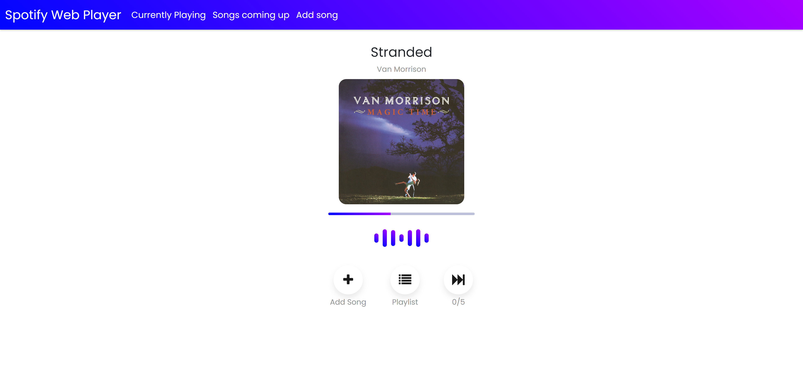
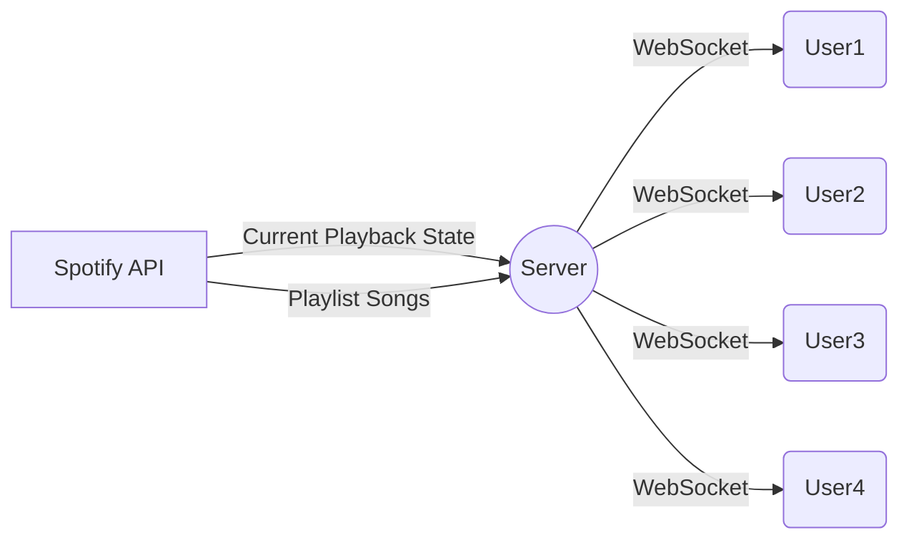

# Spotify Web Party Player

***Spotify Web Party Player*** is a **Node.js** application, built on the **Express** framework and the **Socket.io** library, that lets people control music of a party, just by accessing your local server running the app. 
The server uses **websockets** to send the spotify API data to the users efficiently.

# Installation

The main application is **app.js**. Make a  **.env** file ,***in the root directory***, that contains the following fields:

 - **CLIENT_ID**
 - **CLIENT_SECRET**
 - **REDIRECT_URI**
 - **PLAYLIST_ID**
 - **IP**

The ***CLIENT_ID, CLIENT_SECRET, REDIRECT_URI*** you get from the spotify dashboard of your spotify account. You will also need to fill the ***PLAYLIST_ID*** with the playlist id of the party and the ***IP*** field with your local ip address, that others will use to access your local server. ***Before the app is able to use the spotify API you need to access the "/authenticate" route from the server machine and authenticate it with  your spotify account.***

## Usability

Users accessing your server can:

 - Add a song to your playlist by pasting the spotify url of the song.
 - View the next songs of your playlist.
 - Vote to skip a song. (once per song)
 
 The host of the party can access the **"/secret"** route that gives him **control without limitations**,
 (e.g set the music volume, add a song, vote to skip a song as many times as he likes per song, pause the music, start the music).
 
 
This is what the user sees when accessing the home route "/".
 
## Diagram
Basically, this is how the app works.

